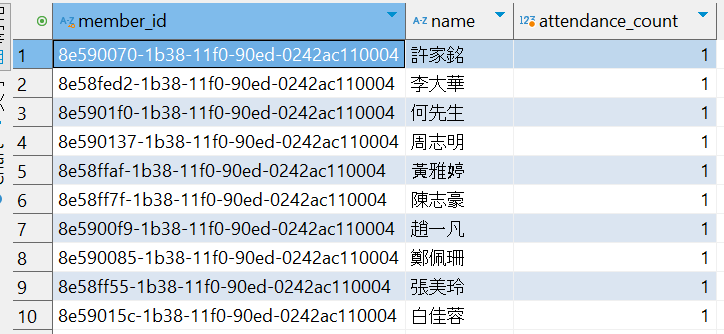

# Lab-06
0522資料庫設計

## 1. 查詢與效能運算練習
#### 題目 1-1
列出「過去 6 個月未曾進場過的會員」的 member_id 與 name。

**NOT IN**
- 耗時2.8秒
- 適合小規模資料量
```
SELECT M.member_id, M.name
FROM Members M
WHERE M.role = 'STUDENT'
  AND M.member_id NOT IN (
    SELECT member_id
    FROM Registrations
    WHERE entry_time >= DATE_SUB(CURDATE(), INTERVAL 6 MONTH)
      AND entry_time IS NOT NULL
  );
```

**NOT EXISTS**
- 語意明確，效能良好，利於日後維護與理解
- NOT EXISTS 子查詢能確保「沒有任何一筆進場記錄符合條件」時，才會列出該名學生
- 效率明顯優於 JOIN 寫法，特別適合大筆數資料查詢
- 耗時3秒
```
SELECT M.member_id, M.name
FROM Members M
WHERE M.role = 'STUDENT'
  AND NOT EXISTS (
    SELECT 1
    FROM Registrations R
    WHERE R.member_id = M.member_id
      AND R.entry_time >= DATE_SUB(CURDATE(), INTERVAL 6 MONTH)
      AND R.entry_time IS NOT NULL
  );
  ```

**LEFT JOIN ... IS NULL法**
- 語意偏差：題目要求是最近6個月沒進場的會員，使用 LEFT JOIN 的可能會將從未進場或6個月前有進場過的會員一起列出
- 執行效率低落：使用 LEFT JOIN+日期條件在 JOIN 上，對於大量資料會產生全表掃描與多餘資料行，導致效能低（本例實測需 5 秒左右）
```
SELECT M.member_id, M.name
FROM Members M
LEFT JOIN Registrations R
  ON M.member_id = R.member_id 
  AND R.entry_time >= DATE_SUB(CURDATE(), INTERVAL 6 MONTH)
WHERE M.role = 'STUDENT' AND R.entry_time IS NULL;
```


#### 題目 1-2
列出同時報名過兩個指定時段（假設 course_schedule_id = 'A'、B'）的會員
**GROUP BY + HAVING**
- 耗時2.2秒
- 語意直覺，效能及資料庫可讀性通常都較優
```
SELECT member_id
FROM Registrations
WHERE course_schedule_id IN ('A', 'B')
GROUP BY member_id
HAVING COUNT(DISTINCT course_schedule_id) = 2;
```

**自 JOIN**
- 耗時2.6秒
- 與 GROUP BY + HAVING 邏輯一致，但效率較慢
```
SELECT DISTINCT R1.member_id
FROM Registrations R1
JOIN Registrations R2
  ON R1.member_id = R2.member_id
WHERE R1.course_schedule_id = 'A'
  AND R2.course_schedule_id = 'B';
```


## 2. 子查詢與 EXISTS 效能比較
#### 題目 2-1
找出「本月內沒有任何進場記錄」的會員

**NOT EXISTS**
```
SELECT m.*
FROM Members m
WHERE NOT EXISTS (
  SELECT 1
  FROM Registrations r
  WHERE r.member_id = m.member_id
    AND r.entry_time IS NOT NULL
    AND YEAR(r.entry_time) = YEAR(CURRENT_DATE())
    AND MONTH(r.entry_time) = MONTH(CURRENT_DATE())
);
```

**NOT IN**
```
SELECT m.*
FROM Members m
WHERE m.member_id NOT IN (
  SELECT r.member_id
  FROM Registrations r
  WHERE r.entry_time IS NOT NULL
    AND YEAR(r.entry_time) = YEAR(CURRENT_DATE())
    AND MONTH(r.entry_time) = MONTH(CURRENT_DATE())
);
```

**LEFT JOIN ... IS NULL**
```
SELECT m.*
FROM Members m
LEFT JOIN Registrations r
  ON m.member_id = r.member_id
  AND r.entry_time IS NOT NULL
  AND YEAR(r.entry_time) = YEAR(CURRENT_DATE())
  AND MONTH(r.entry_time) = MONTH(CURRENT_DATE())
WHERE r.registration_id IS NULL;
```


- 分別以 NOT EXISTS、NOT IN、以及 LEFT JOIN ... IS NULL 實現。
- 使用 EXPLAIN 分析三種寫法的執行計畫，並比較其效能差異。

#### 題目 2-2
列出「至少曾參加自己擔任教練課程」的教練清單

**EXITS**
```
SELECT DISTINCT s.staff_id, s.name
FROM StaffAccounts s
WHERE s.role = 'COACH'
  AND EXISTS (
    SELECT 1
    FROM Courses c
    JOIN CourseSchedules cs ON c.course_id = cs.course_id
    JOIN Registrations r ON cs.course_schedule_id = r.course_schedule_id
    WHERE c.coach_id = s.staff_id
      AND r.member_id = s.staff_id
  );
  ```


- 教練必須同時出現在 StaffAccounts，並在 Courses 內綁定為該課程 coach。
- 他至少有一次以會員身份（在 Members）報名自己所帶的課程 (Registrations)。
- 請使用 EXISTS 撰寫查詢，需特別留意同一人員在 Members、StaffAccounts 兩表都可能有紀錄。

## 3. 聚合與索引優化練習
#### 題目 3-1
列出每位教練、其課程、課次總數，及平均每場報名人數

- 盡量將「資料量最多的表先分組/聚合成較小結果後，再 JOIN 或 GROUP BY」，而非直接全部 JOIN 後分組
- 通常建議與大表子查詢聚合的寫法搭配合適索引，能導致最快的分組速度。

```
SELECT
    sa.staff_id,
    sa.name AS coach_name,
    c.course_id,
    c.name AS course_name,
    COUNT(cs.course_schedule_id) AS total_sessions,
    AVG(COALESCE(session_reg.counts, 0)) AS avg_registrations_per_session   -- ◎
FROM StaffAccounts sa
JOIN Courses c ON sa.staff_id = c.coach_id
JOIN CourseSchedules cs ON c.course_id = cs.course_id
LEFT JOIN (
    SELECT course_schedule_id, COUNT(*) AS counts
    FROM Registrations
    GROUP BY course_schedule_id
) session_reg ON cs.course_schedule_id = session_reg.course_schedule_id
WHERE sa.role = 'COACH'
GROUP BY sa.staff_id, c.course_id;
```


- 需 JOIN Courses、StaffAccounts、CourseSchedules、Registrations 四表。
- 輸出欄位：教練姓名、課程名稱、課表數、總報名人次、平均報名人數。
- 請思考：在 JOIN 及 GROUP BY 的排程與順序上，哪種組合能夠最佳化群組速度？若資料量龐大，可考慮在哪些欄位上建立（複合）索引？

#### 題目 3-2
找出三個月內報到次數最多的 10 名會員（member_id, name, 出席次數）
**JOIN + GROUP BY**
- 耗時5秒，屬於慢查詢範圍，代表目前效能還有優化空間
- 可以加索引的主要欄位，提升此查詢效能： <br>
    (1) Registrations.member_id <br>
    (2) Registrations.entry_time <br>
    (3) 複合索引：在 Registrations 表 上建立複合索引：(entry_time, member_id) <br>
    (4) Members.member_id <br>

```
SELECT 
    m.member_id,
    m.name,
    COUNT(r.entry_time) AS attendance_count
FROM 
    Members m
JOIN 
    Registrations r ON m.member_id = r.member_id
WHERE 
    r.entry_time IS NOT NULL
    AND r.entry_time >= DATE_SUB(NOW(), INTERVAL 3 MONTH)
GROUP BY 
    m.member_id, m.name
ORDER BY 
    attendance_count DESC
LIMIT 10;
```



- 請避免不必要的子查詢，儘量以 JOIN 搭配 GROUP BY 完成。
- 思考有哪些欄位可加索引，以提升此查詢效能。

## 4. 三值邏輯與重複/例外資料查核
#### 題目 4-1
查出 entry_time 為 NULL 的報名紀錄，並顯示會員與課程名稱 

**IS NULL + JOIN**
```
SELECT r.registration_id, m.name AS member_name, c.name AS course_name, r.entry_time
FROM Registrations r
JOIN Members m ON r.member_id = m.member_id
JOIN CourseSchedules cs ON r.course_schedule_id = cs.course_schedule_id
JOIN Courses c ON cs.course_id = c.course_id
WHERE r.entry_time IS NULL;
```


- 表示該會員雖然預約了，但尚未實際進場或資料遺漏。
- 注意 IS NULL 的用法，並透過 JOIN 取出該會員及課程完整資訊。

#### 題目 4-2
檢查同一會員在同一時段報名多次的情況

**GROUP BY ... HAVING** 
- 這會列出有重複報名的(member_id, course_schedule_id)組合（cnt > 1）
```
SELECT member_id, course_schedule_id, COUNT(*) AS cnt
FROM Registrations
GROUP BY member_id, course_schedule_id
HAVING cnt > 1;
```


**自我聯結（Self Join）**
- 這會找出繼有同一個member_id、同一個course_schedule_id、但registration_id不同的記錄
```
SELECT r1.registration_id, r1.member_id, r1.course_schedule_id
FROM Registrations r1
JOIN Registrations r2
  ON r1.member_id = r2.member_id
 AND r1.course_schedule_id = r2.course_schedule_id
 AND r1.registration_id <> r2.registration_id;
 ```
 


- 若資料結構允許重複，找出 member_id, name, course_schedule_id 與「報名次數 (cnt) > 1」的紀錄。
- 若沒有任何重複，請顯示「無重複資料」。

## 5. 多表關聯與綜合查詢效能
#### 題目 5-1
列出每位教練「本月」課程所有時段的平均出席人數

- 請 JOIN StaffAccounts、Courses、CourseSchedules、Registrations，並利用 GROUP BY 教練、課程。
- 使用 EXPLAIN 分析你的寫法，以觀察在大資料量下的索引使用情況或可能的全表掃描。
- 思考：可在哪些欄位加索引來優化這個多表 JOIN 與群組運算？

#### 題目 5-2
列出一年內「從未缺席任何一場已報名時段」的學員名單（全勤會員）

- 條件：每一筆 Registrations 都有 entry_time（不為 NULL）。
- 若只使用 NOT EXISTS 或 NOT IN 實作，何者效能較佳？是否有更好的方法？
- 試想：可在 Registrations 或其他表格上建何種索引，來加速查詢？

